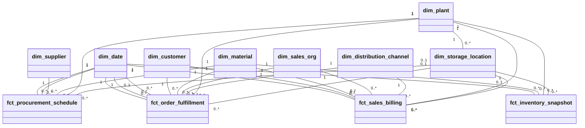
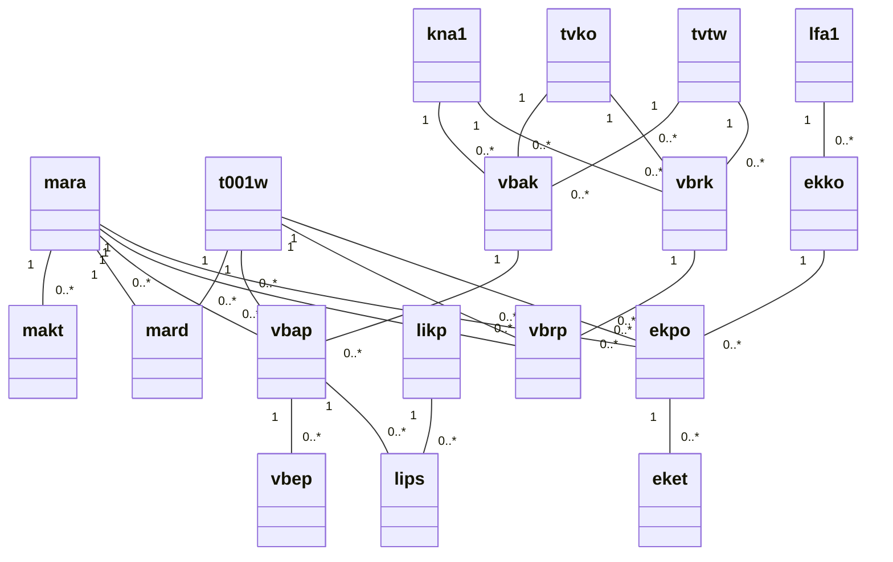

# GreenPlanetMart ERD Model

This version uses Mermaid `classDiagram` syntax because it is more reliable in older or extension-based VS Code Mermaid previews and supports end-cardinalities on plain relationships.

## Analytical Star Schema

### Fact Grains

- `fct_inventory_snapshot`: one row per `material x plant x storage_location x snapshot_date`
- `fct_sales_billing`: one row per billing item
- `fct_order_fulfillment`: one row per sales order item in the implemented mart
- `fct_procurement_schedule`: one row per `purchase_order_item x schedule_line`

## Core Operational Source Model

## Relational Summary

- One customer can have many sales orders and billing documents.
- One sales order header can have many sales order items.
- One sales order item can have many schedule lines.
- One delivery header can have many delivery items.
- One billing header can have many billing items.
- One purchase order header can have many purchase order items.
- One purchase order item can have many schedule lines.
- One material can appear in inventory, sales, billing, fulfillment, and procurement rows.
- One plant can appear in inventory, sales, billing, fulfillment, and procurement rows.
- One supplier can have many purchase orders.

## Notes

- The analytical model is implemented in `project_implementation/dbt_greenplanetmart/models/marts`.
- `dim_date` is reused in multiple roles for billing, order, requested delivery, actual delivery, purchase order, and planned delivery dates.
- `dim_storage_location` depends on plant and is keyed by `client_id + plant_id + storage_location_id`.
- In DuckDB, referential integrity is validated mainly by dbt tests and model logic instead of database-enforced foreign keys.
